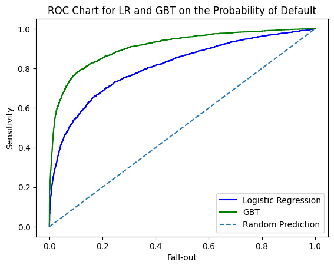
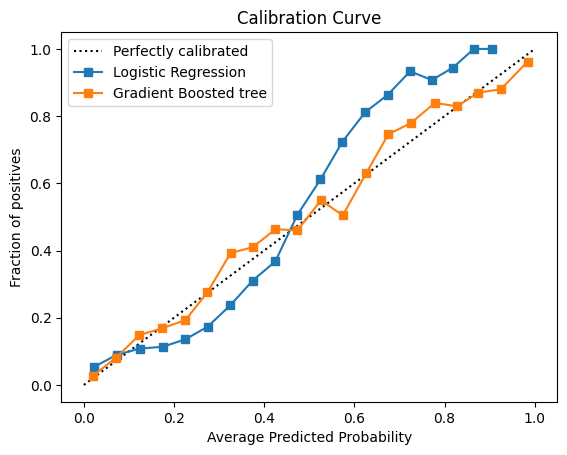

# Credit Risk Modeling

This project contains a Python notebook for credit risk modeling.

## Project goal
Using Logistic Regression and XGBoost in Python to predict the probability of customer default, total expected loss etc. and compare the performance of the two models.

## Tools used
- Python
- Jupyter Notebook
- pandas
- scikit-learn
- matplotlib

## File
- `Credit_Risk_Modelling_in_Python.ipynb`: main notebook for the project

## Reference
Data Camp Course "Credit Risk Modeling in Python"

## Model Performance

